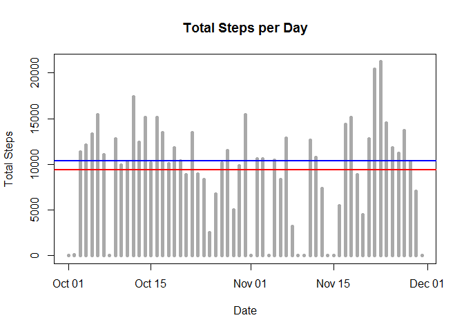
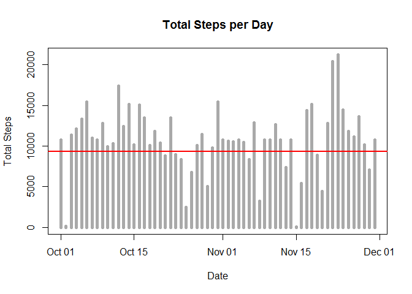
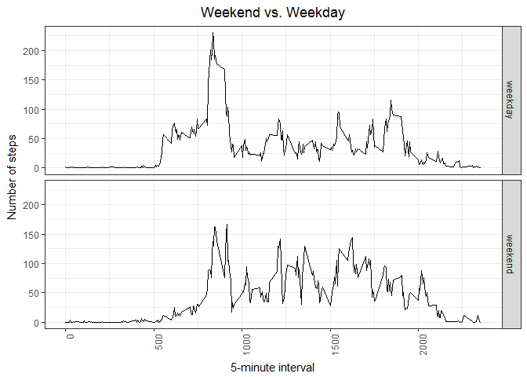

# Reproducible Research: Peer Assessment 1
## Load Libraries

```r
library(dplyr)
library(ggplot2)
```


## Loading and preprocessing the data

```r
unzip(zipfile = "activity.zip")
activity <- read.csv("activity.csv", stringsAsFactors = FALSE)

# convert the date field to an actual date
activity <- mutate(activity, date = as.Date(date, format = '%Y-%m-%d'))
```


## What is mean total number of steps taken per day?

```r
# Histogram of the total number of steps taken each day
aggactivity <- activity %>% select(date, steps) %>%
  group_by(date) %>%
  summarise(dailysteps = sum(steps, na.rm = TRUE))

# create histogram
plot(aggactivity$date, aggactivity$dailysteps, type="h", main="Total Steps per Day", xlab="Date", ylab="Total Steps", col="dark grey", lwd=5)
abline(h = mean(aggactivity$dailysteps, na.rm = TRUE), col = "red", lwd = 2)
abline(h = median(aggactivity$dailysteps, na.rm = TRUE), col = "blue", lwd = 2)
```

<!-- -->

```r
# Mean and number of steps taken each day
mean(aggactivity$dailysteps, na.rm = TRUE)
```

```
## [1] 9354.23
```

```r
# median number of steps taken each day
median(aggactivity$dailysteps, na.rm = TRUE)
```

```
## [1] 10395
```


## What is the average daily activity pattern?

```r
# What is the average daily activity pattern?
# Time series plot of the average number of steps taken
avgdailypattern <- activity %>% select(steps, interval) %>% group_by(interval) %>% summarise(avgsteps = mean(steps, na.rm =TRUE))

# frequency plot of daily pattern
ggplot(avgdailypattern, aes(interval, avgsteps)) + 
  geom_line() + 
  xlab("5-minute interval") + ylab("Avg Number of steps") + 
  ggtitle("Avg Step Profile") +
  theme_bw() + theme(axis.text.x = element_text(angle = 90, hjust = 1), plot.title = element_text(hjust = 0.5)) 
```

<!-- -->

```r
#5-minute interval with the maximum number of steps
avgdailypattern[which.max(avgdailypattern$avgsteps),]$interval
```

```
## [1] 835
```

## Imputing missing values

```r
# Calculate the total number of missing values
missingvalues <- sum(!complete.cases(activity))

# number of missing values
missingvalues
```

```
## [1] 2304
```

```r
# Chosen strategy: Equivalent to orignal with the missing data filled in with daily average of steps for specified interval.
filledactivity <- activity
for (i in 1:nrow(filledactivity))
{
  if(is.na(filledactivity[i,]$steps)) 
    {
      filledactivity[i,]$steps = avgdailypattern[which(avgdailypattern$interval==filledactivity[i,]$interval),]$avgsteps
    }
}

# aggregate to compute the dailysteps
aggfilledactivity <- filledactivity %>% select(date, steps) %>%
  group_by(date) %>%
  summarise(dailysteps = sum(steps, na.rm = TRUE))


# Make a histogram of the total number of steps taken each day 
plot(aggfilledactivity$date, aggfilledactivity$dailysteps, type="h", main="Total Steps per Day", xlab="Date", ylab="Total Steps", col="dark grey", lwd=5)
abline(h = mean(aggactivity$dailysteps, na.rm = TRUE), col = "red", lwd = 2)
```

<!-- -->

```r
# mean total number of steps taken per day
mean(aggfilledactivity$dailysteps, na.rm = TRUE)
```

```
## [1] 10766.19
```

```r
# median total number of steps taken per day. 
median(aggfilledactivity$dailysteps, na.rm = TRUE)
```

```
## [1] 10766.19
```

#### Do these values differ from the estimates from the first part?
Yes. These values differ from the estimates of the first part.  

#### What is the impact of imputing missing data on the estimates of the total daily number of steps?
The mean and median in this case are the same.


## Are there differences in activity patterns between weekdays and weekends?

```r
# Activity patterns between weekdays and weekends?
filledactivity <- mutate(filledactivity, wday = weekdays(date))
filledactivity <- mutate(filledactivity, iswday = as.factor(ifelse(wday %in% c('Saturday', 'Sunday'), "weekend", "weekday")))

# avg daily patterns of filled activity
filledavgdailypattern <- filledactivity %>% 
  select(steps, interval, iswday) %>% 
  group_by(iswday, interval) %>% 
  summarise(avgsteps = mean(steps, na.rm =TRUE))

# Panel plot containing a time series plot of the 5-minute interval (x-axis) 
ggplot(filledavgdailypattern, aes(interval, avgsteps)) + 
  geom_line() + 
  facet_grid(iswday ~ .) + 
  xlab("5-minute interval") + ylab("Number of steps") + 
  ggtitle("Weekend vs. Weekday") +
  theme_bw() + theme(axis.text.x = element_text(angle = 90, hjust = 1), plot.title = element_text(hjust = 0.5)) 
```

<!-- -->
